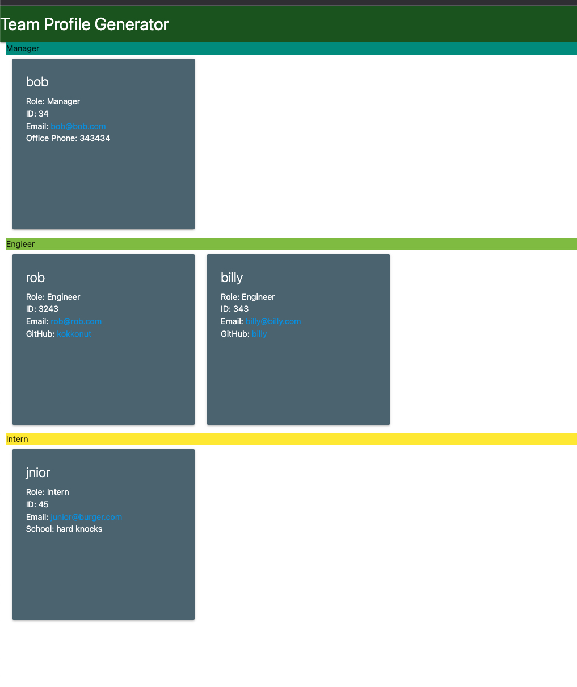

# Team Profile Generator 

## Description
This app generates team profiles , has sections from Managers, Engineers and Interns

## Installation
All dependacies inculed in package.json .just run NPM i

## Usage Instructions
after running npm i, run Node index to start app. You will be promted with which sort of user you want to add. once all users are added exit app. on exit index.html will be generated

## Credits
N/A

## Screenshot

## Issues
There is a very minor issue where the first prompted question  is not for a a Manager

## Link to deployed Site
[Team Profile Generator](N/A)

## Contact
Nicfranekel@gmail.com

[Github](https://github.com/Kokkonut)

## My Git

  ## License
  
  
    ### MIT License
    
    > Copyright (c) [2022] [Nicolas Fraenkel]
    > 
    > __Permission is hereby granted, free of charge, to any person obtaining a copy__
    > __of this software and associated documentation files (the "Software"), to deal__
    > __in the Software without restriction, including without limitation the rights__
    > __to use, copy, modify, merge, publish, distribute, sublicense, and/or sell__
    > __copies of the Software, and to permit persons to whom the Software is__
    > __furnished to do so, subject to the following conditions:__
    > 
    > The above copyright notice and this permission notice shall be included in all
    > copies or substantial portions of the Software.
    > 
    > THE SOFTWARE IS PROVIDED "AS IS", WITHOUT WARRANTY OF ANY KIND, EXPRESS OR
    > IMPLIED, INCLUDING BUT NOT LIMITED TO THE WARRANTIES OF MERCHANTABILITY,
    > FITNESS FOR A PARTICULAR PURPOSE AND NONINFRINGEMENT. IN NO EVENT SHALL THE
    > AUTHORS OR COPYRIGHT HOLDERS BE LIABLE FOR ANY CLAIM, DAMAGES OR OTHER
    > LIABILITY, WHETHER IN AN ACTION OF CONTRACT, TORT OR OTHERWISE, ARISING FROM,
    > OUT OF OR IN CONNECTION WITH THE SOFTWARE OR THE USE OR OTHER DEALINGS IN THE
    > SOFTWARE.
    
    
